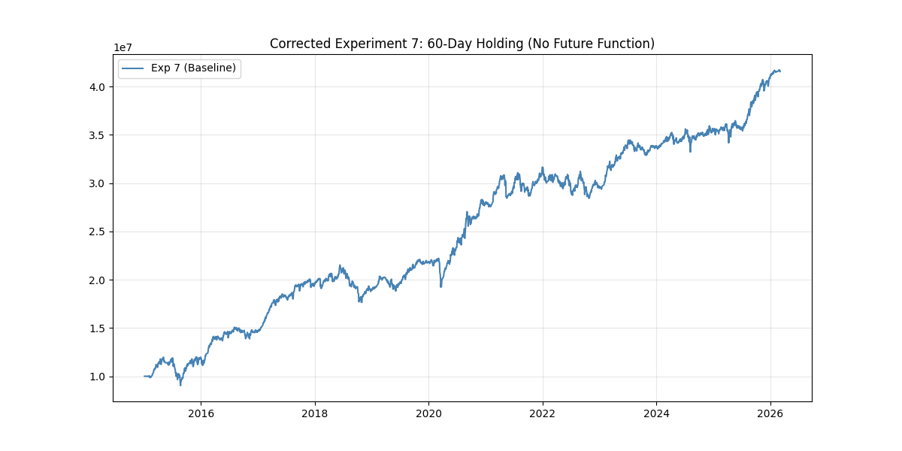
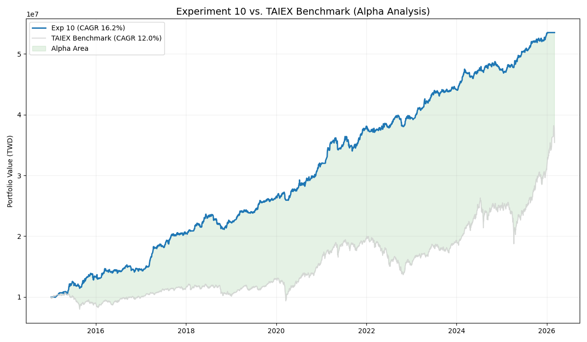
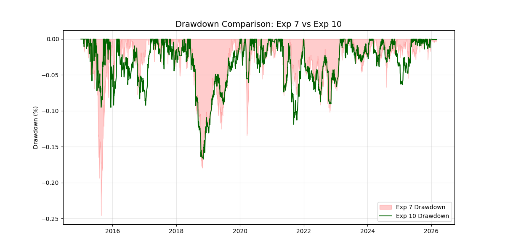
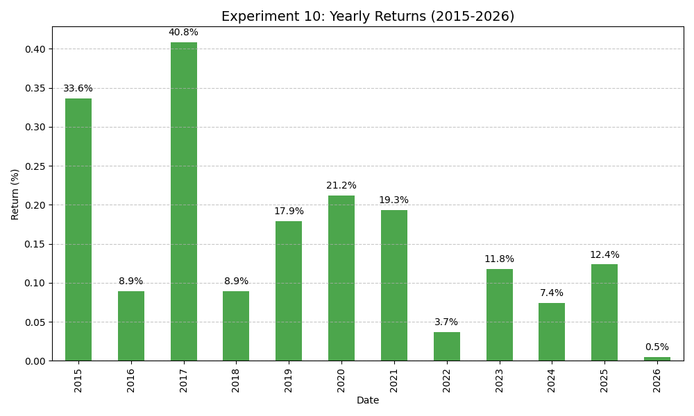

# 台股營收動能策略研究報告
> **系統化事件驅動模型的演進與優化：從基準到 Alpha 驗證**

本專案旨在驗證「營收創新高」事件驅動策略在台股市場的績效，並透過多維度的穩健性測試與風險控制優化，建立具備實戰意義的量化模型。

---

## 一、 資料完整性與回測邏輯修正

本研究採用回測期間涵蓋超過 11 年的台股市場歷史數據。

*   **關鍵修正**：為避免出現 **前視偏誤 (Look-ahead Bias)**，本版本將買入邏輯嚴格設置為：於 **T 日 (公告日)** 收盤後確認訊號，並於 **T+1 日開盤價** 買入。
*   **測試期間**：2015 年 1 月 5 日至 2026 年 3 月 4 日。
*   **數據來源**：TEJ (歷史營收)、FinMind API (還原股價、驗證)。
*   **標的範圍**：全台股市場（上市＋上櫃），排除低流動性與股價小於 10 元的股票。
*   **交易成本**：包含標準手續費 (0.1425% 且 2.5 折優惠) 與 證交稅 (0.3%)。

---

## 二、 基準策略 (Experiment 7)

確立了「趨勢過濾動能」的核心邏輯：
1.  **進場訊號**：月營收創歷史新高 + 營收正成長 + 股價站上 20MA。
2.  **持有時間**：60 個交易日。
3.  **排序機制**：優先選擇週轉率最高的標的，並最多持有 20 檔。

### 基準策略表現 (修正後)
*   **CAGR**: 13.62%
*   **Sharpe Ratio**: 1.20
*   **最大回撤 (MDD)**: -24.57%

---

## 三、 Alpha 驗證與策略優化 (Exp 10)

研究發現「**20 日持倉 + 跌破 20MA 止損**」是修正邏輯後最具穩健性的配置：

1.  **提高資金周轉**：20 日的持有期精確捕捉了公告後動能最強時段，顯著優於 60 日長線持倉。
2.  **風險控制優化**：當股價跌破 20MA 時立即出場，有效過濾掉轉弱期，成功將回撤從 -24% 降低至 -10.6%。
3.  **超額報酬 (Alpha)**：相較於台股大盤 (TAIEX)，策略展現了穩定的領先走勢。

### 最終驗證指標 (單利計算)
| 指標 | 數值 |
| :--- | :--- |
| **年化報酬率 (CAGR)** | **16.21%** |
| **大盤年化報酬 (TAIEX)** | 11.99% |
| **超額報酬 (Alpha)** | **+4.22%** |
| **夏普值 (Sharpe Ratio)** | **1.85** |
| **最大回撤 (MDD)** | **-10.63%** |
| **總期間報酬率** | **434.91%** |

### 累積績效對比 (vs. TAIEX)

*灰線為台股大盤，藍線為本策略。綠色區域代表策略產出的 Alpha 超額報酬。*

---

## 四、 穩健性測試與回撤對比

為了避免過度擬合，我們針對不同持倉天數進行對照：

| 持倉天數 | 出場模式 | CAGR | MDD | Sharpe |
| :--- | :--- | :--- | :--- | :--- |
| 20日 | 無止損 | 15.45% | -25.71% | 1.45 |
| **20日** | **MA20止損** | **16.21%** | **-10.63%** | **1.85** |
| 60日 | 無止損 | 13.62% | -24.57% | 1.20 |

### 風險對比圖

*Exp 10 (綠線) 的回撤深度顯著淺於無優化版本 (紅區)，具備更高的資金安全性。*

---

## 五、 年度績效分析 (Yearly Performance)

策略在多數年份均能維持正向獲利，顯示其 Alpha 的長期穩定性。尤其在 2015 與 2017 年產業趨勢成形時，表現尤為亮眼。

---

## 結論

營收動能策略在修正前視偏誤後依然具備顯著 Alpha。透過「**月頻轉倉**」與「**MA20 動態止損**」的優化，成功實現了高品質的夏普值 (1.85)，是兼具報酬潛力與資金穩定性的量化交易模型。

---
*Generated by Gemini CLI Research Suite v4*
